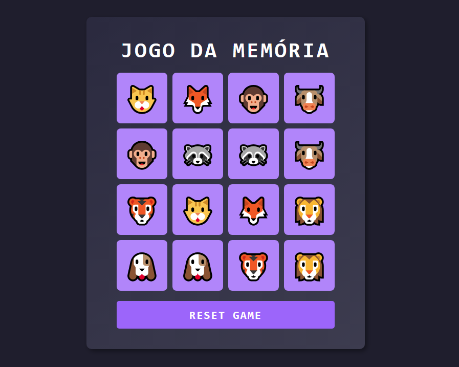

### 📄 **README.md**  

```md
# 🎮 Jogo da Memória com Emojis  

Este é um jogo da memória divertido desenvolvido com HTML, CSS e JavaScript, utilizando emojis como cartas. O objetivo é encontrar todos os pares de emojis no menor tempo possível.

---

## 📌 **Tecnologias Utilizadas**
- **HTML** → Estrutura do jogo  
- **CSS** → Estilização e efeitos visuais  
- **JavaScript** → Lógica do jogo e interação  

---

## 📂 **Estrutura do Projeto**  
js-emoji-memory-game/
│── index.html            # Página principal do jogo
│── README.md             # Documentação do projeto
│
├── src/
│   ├── styles/
│   │   ├── reset.css     # Reset global de estilos
│   │   ├── main.css      # Estilos do jogo
│   │
│   ├── scripts/
│   │   ├── engine.js     # Lógica do jogo (embaralhamento, cliques, pares)
│
```
---

## 🚀 **Como Executar o Projeto?**

### 🔹 **1. Baixe ou Clone o Repositório**
```sh
git clone https://github.com/seu-usuario/js-emoji-memory-game.git
```

### 🔹 **2. Acesse a pasta do projeto**
```sh
cd js-emoji-memory-game
```

### 🔹 **3. Abra o `index.html` no navegador**
- Basta clicar duas vezes no arquivo `index.html` para abrir no navegador **ou**  
- Rodar via terminal:  
  ```sh
  start index.html  # No Windows
  open index.html   # No Mac
  ```

---

## 🎨 **Personalização**
Caso queira modificar os emojis, cores ou número de cartas:
- Abra o arquivo `engine.js` e edite a constante `emojis` para adicionar/remover emojis.  
- Para mudar as cores, edite o arquivo `main.css`.  

---

## 🎯 **Regras do Jogo**
1. Clique em uma carta para virá-la.  
2. Encontre o par correspondente.  
3. Se acertar, as cartas permanecerão visíveis. Se errar, elas voltarão a ficar ocultas.  
4. Continue até encontrar todos os pares.  
5. Ao completar o jogo, uma mensagem de vitória será exibida.  

---

---
# 🕹 **🎮 Jogo da Memória com Emojis**

<p align="center">
  
</p>
---

## 📸 **Captura de Tela do Jogo**


---

## 📌 **Futuras Melhorias**
✅ Animações mais suaves  
✅ Contador de tempo e tentativas  
✅ Modo noturno  

---

## 📜 **Licença**
Este projeto está sob a licença MIT. Sinta-se à vontade para modificar e compartilhar!  

---

👨‍💻 Desenvolvido por **[DIO](https://github.com/digitalinnovationone/js-emoji-memory-game)** 🚀  
```

---

## 📌 O que este `README.md` inclui?
✔️ **Explicação do jogo**  
✔️ **Estrutura do projeto**  
✔️ **Passo a passo para rodar o jogo**  
✔️ **Regras e funcionamento**  
✔️ **Sugestões de personalização**  
✔️ **Imagem de referência (pode adicionar uma real)**  
✔️ **Futuras melhorias e contribuições**  

Agora o projeto está bem documentado e pronto para ser compartilhado! 🎉🚀# js-emoji-memory-game-JJ
